# Hello, I'm Timothe Bertrand 👋

## 🌟 About Me

I'm a Rust enthusiast who loves exploring the world of programming and technology. My primary focus areas include:

- 🦀 **Rust**: Passionate about Rust, its Ecosystem and its capabilities.
- 🛠️ **Development & Architecture**: Designing robust and scalable systems.
- ⚙️ **DevOps**: Implementing best practices for efficient development and operations.
- 🔧 **Embedded Systems & IoT**: Developing cutting-edge solutions for connected devices.

## 🛠️ Tools & Technologies

### Operating Systems (OS)
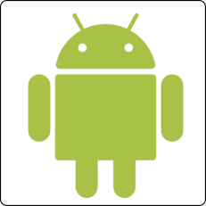 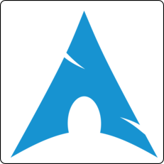
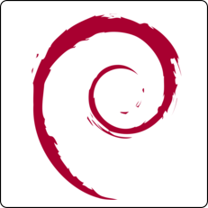
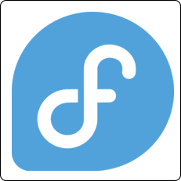
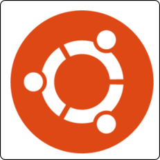
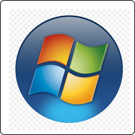
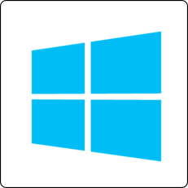
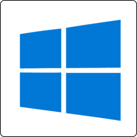
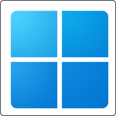
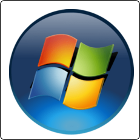
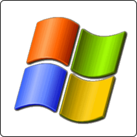

### Programming Languages
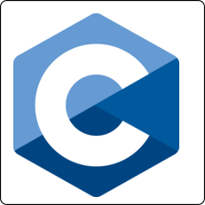 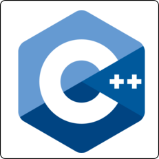
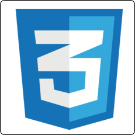

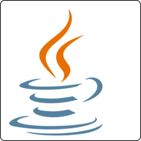
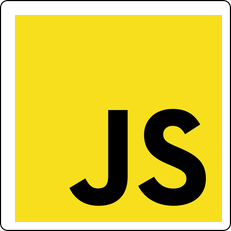
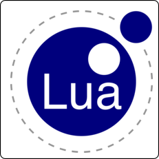
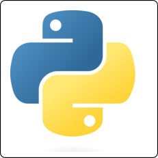
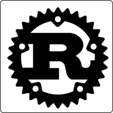
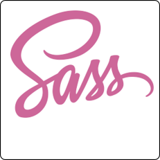
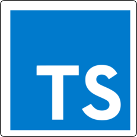

### Frameworks and Libraries
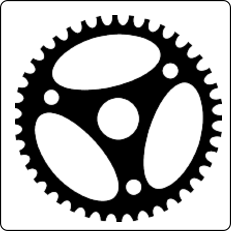 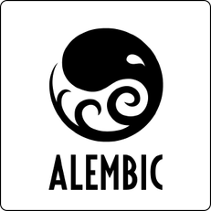
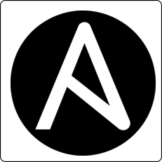
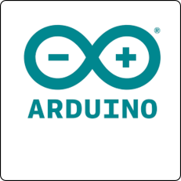
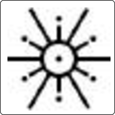
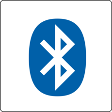
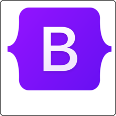

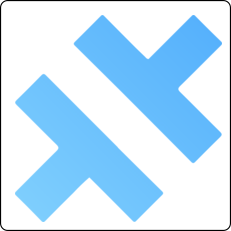
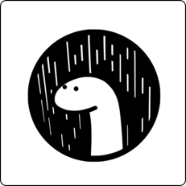
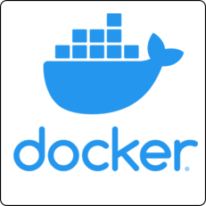

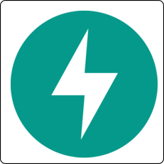
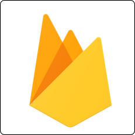
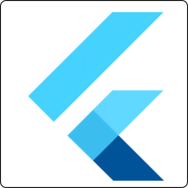

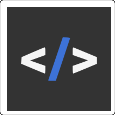
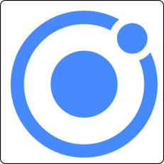

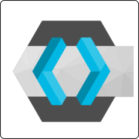
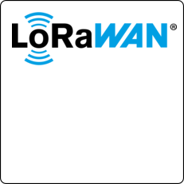
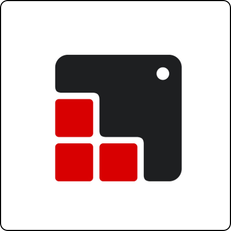

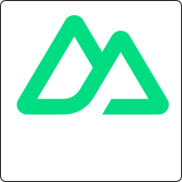
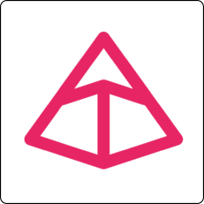
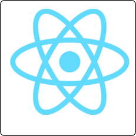
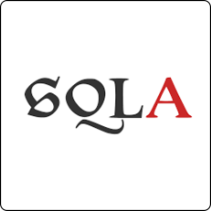
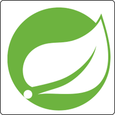
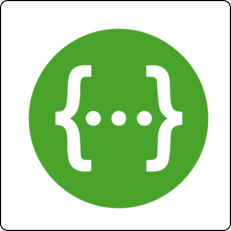
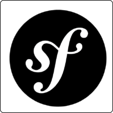

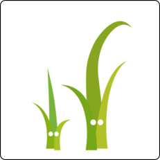
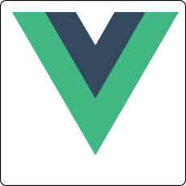
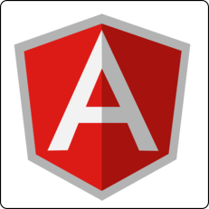
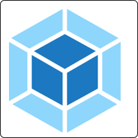

### IDEs and Editors
 

### DevOps and CI/CD
 

### Databases
 

### Virtualization and Containerization
 

### IoT and Embedded Systems
 

### Miscellaneous
 

## 🔗 Connect with Me
I'm documenting my journey of writing a framework on my blog. Follow along to see the progress, challenges, and insights I gain along the way:

- [LinkedIn](https://www.linkedin.com/in/timothé-bertrand-🦀-1a178b200/) 🌐
- [Twitter](https://x.com/Fingardee) 🐦
- [Blog](https://blog.fingarde.fr) - **WIP** ✍️
---

Bisous
